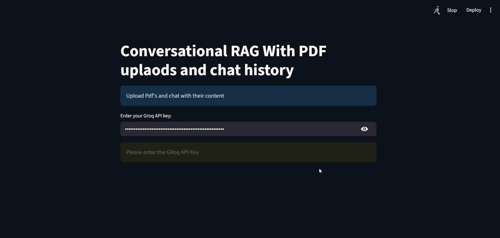

# PDF Bot

An AI-powered PDF document assistant that allows you to interact with and query PDF documents using natural language.

## Project Structure
```
PDF_bot/
├── app.py          # Main application file
├── temp.pdf        # Temporary PDF storage
└── demo/           # Demo materials
    └── RAG_PDF_demo.gif  # Demo animation
```

## Features

- Upload and process PDF documents
- Query documents using natural language 
- Retrieve relevant information from PDFs
- Uses RAG (Retrieval Augmented Generation) for accurate responses

## Installation

1. Clone the repository
```sh
git clone <repository-url>
cd PDF_bot
```

2. Install dependencies
```sh
pip install -r requirements.txt
```

## Usage

Run the application:
```sh
python app.py
```

## Demo



## Technology Stack

- Python
- LangChain
- PDF Processing Libraries
- Vector Database for Document Storage
- LLM for Natural Language Understanding

##